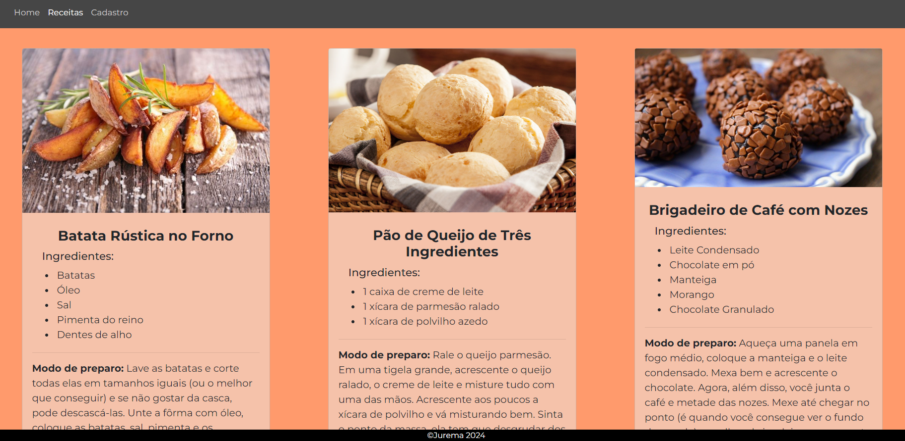
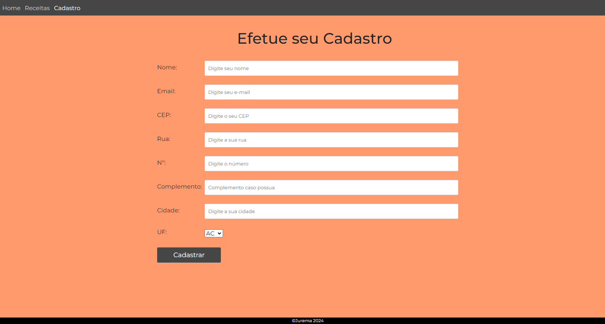

<h1 align="center"> Receitas da Tia Jurema </h1>

Este projeto foi desenvolvido para a Missão Prática | Nível 1 | Mundo 2, da faculdade Estácio de Sá, no curso de Desenvolvimento Full Stack. 
<a href="https://sway.cloud.microsoft/s/5vAvCdLPxlEl682F/embed">Aqui você pode verificar o que foi solicitado na missão.</a>

  <a href="#-tecnologias">Tecnologias</a>&nbsp;&nbsp;&nbsp;|&nbsp;&nbsp;&nbsp;
  <a href="#-projeto">Projeto</a>&nbsp;&nbsp;&nbsp;&nbsp;&nbsp;&nbsp;

 

  
  
  

## 🚀 Tecnologias

Projeto desenvolvido com:

- HTML / CSS
- Git e Github

## 💻 Projeto

O site de receitas da Tia Jurema é um site voltado para receitas e encontra-se, por ora, com conteúdo estático.

- [Acesse o projeto finalizado, online](https://github.com/couto-rafael/dev-links)

- [Conheça a Estácio](https://estacio.br/)

Feito por Rafael, estudante do 2o semestre de Desenvolvimento Full Stack.
